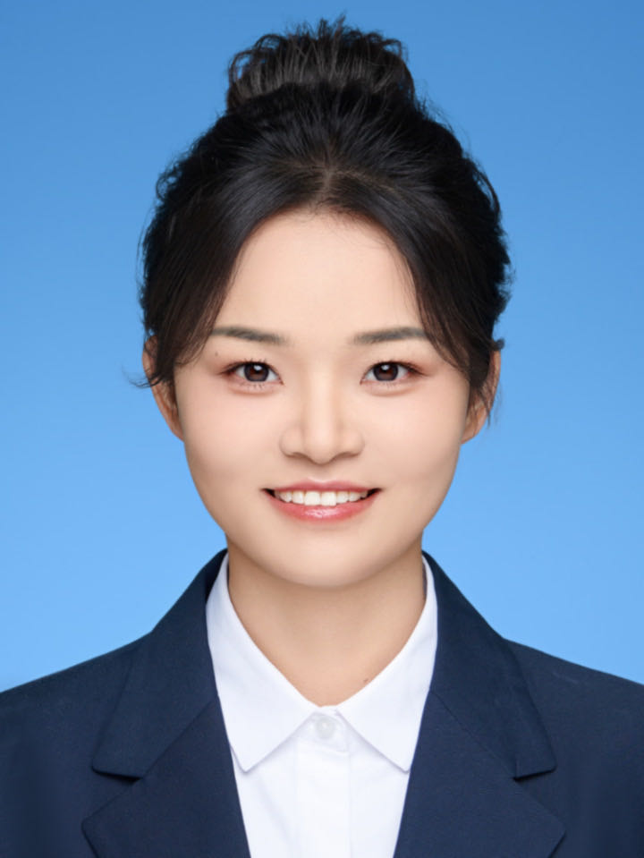

# Huanhuan Ma (马欢欢)

- **Email:** [mhh@mail.ustc.edu.cn](mhh@mail.ustc.edu.cn) 
- **University of Science and Technology of China (USTC)**

## Biography
I am currently a Ph.D student at University of Science and Technology of China, supervised by Prof. Jiansong Deng, and Prof. Jingrun Chen. Before that, I received my Master's degree of computing mathematics from Hefei University of Technology, and received my Bachelor’s Degree of mathematics and applied mathematics from Fuyang Normal University.

My research interest includes meshless methods and material point method.

## Publications
-  **Analysis of the dynamic response for Kirchhoff plates by the element-free Galerkin method**  
  **Huanhuan Ma**, Jingrun Chen, Jiansong Deng 
  *Journal of Computational and Applied Mathematics,Accepted.*

-  **Error analysis of the element-free Galerkin method for a nonlinear plate problem**  
  **Huanhuan Ma**, Jingrun Chen, Jiansong Deng  
  *Computers & Mathematics with Applications, Vol. 163, 2024.*

-  **Convergence analysis of the element-free Galerkin method for plate bending problem**  
  **Huanhuan Ma**, Jingrun Chen, Jiansong Deng  
  *Computers & Mathematics with Applications, Vol. 136, 2023.*

-  **Isogeometric Analysis Using Basis Functions of Splines Spaces over Hierarchical T-meshes with High Level Differences**  
  Jingjing Liu, Fang Deng, **Huanhuan Ma**, Jiansong Deng  
  *Communications in Mathematics and Statistics, Vol. 28, 2023.*

-  **A Combined Approximating and Interpolating Ternary 4-point Subdivision Scheme**  
  Li ZHANG, **Huanhuan Ma**, Shuo Tang, Jieqing Tan.  
  *Journal of Computational and Applied Mathematics, Vol. 349, 2019.*

-  **A Class of Detailed Features Preserving Combined m-ary Subdivision Schemes with Two Parameters**  
  Li ZHANG, **Huanhuan Ma**, Shuo Tang, Jieqing Tan.
  *Journal of Computer-Aided Design and Computer Graphics,2019*

-  **一类融合逼近和插值的曲线细分**  
  **马欢欢**, 张莉, 唐烁，檀结庆.
  *《计算数学》,2019*

   
